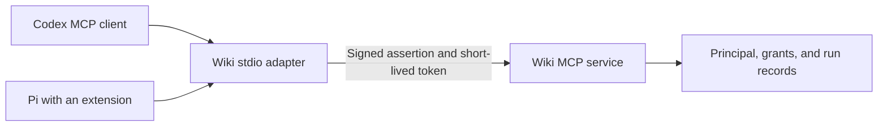

# Agent identities across Codex, Pi, and Claude

Implementation update: the bundled Pi bridge and normal-session setup now exist;
synthetic model-driven article/trace search and read, save/read-back, and shutdown
passed on Pi 0.84.4. See [current setup](agent-setup.md#pi). The research below
records the earlier comparison; its missing-integration statements describe that
baseline, not the current installation. Advanced lifecycle cases remain unqualified.

Research date and evidence cutoff: September 12, 2026. Implementation reviewed:
`e9d5a5e849969b66c40b02152767df61f68a6fad`. Decision: retain the runtime-neutral
identity and adapter design, describe its custom boundaries accurately, and qualify
Pi and Claude client integrations before deployment. **Decision-ready for supporting
all three through the shared adapter; production Pi integration and advanced Claude lifecycle cases remain
unverified.**

The setup is an Agentic Wiki identity system connected through MCP. The Codex
connection follows its documented local MCP configuration. Neither the public
registration JSON nor the agent/run model is an OpenAI agent-definition format.
Pi can use the same wiki adapter through an extension; the installed Pi runtime
passed a small synthetic integration probe. This does not make every Pi MCP
package compatible or make the complete setup a standard agent manifest.

## What belongs to which layer

| Layer                                                                         | Owner and contract                                                 | Portability                                                                         |
| ----------------------------------------------------------------------------- | ------------------------------------------------------------------ | ----------------------------------------------------------------------------------- |
| Model, reasoning, conversation, execution, scheduling                         | The selected runtime                                               | Configure separately in Codex, Pi, or another host.                                 |
| Named principal, owner, instructions version, grants, delegation, run records | Agentic Wiki                                                       | Independent of model provider or harness.                                           |
| Connection JSON and public registration JSON                                  | Agentic Wiki's application schema                                  | Reusable by its adapter; not a universal MCP or Codex configuration format.         |
| Signed client assertion, token exchange, bearer authentication                | OAuth mechanisms implemented using the official MCP SDK and `jose` | Established mechanisms, with wiki-specific assertion fields and lifecycle behavior. |
| Local adapter's tools and initialization instructions                         | MCP over stdio                                                     | Usable by a compatible MCP client.                                                  |
| `mcp_servers.wiki.command` and `args`                                         | Codex configuration                                                | Codex-specific wiring. Pi needs an extension or another supported bridge.           |

The agent's display name and filenames are chosen labels. Its database ID is its
stable identity. Multiple adapter processes using one connection represent
multiple runs of that identity. A runtime's subagent name does not register a new
wiki principal or issue another credential. A wiki definition's instructions are
MCP server guidance; they do not select the model or replace the runtime's own
agent definition and system instructions. These conclusions follow from the
[setup contract](agent-setup.md), [client implementation](../src/agent-client.mjs),
[registration store](../src/agent-store.mjs), and [stdio bridge](../scripts/agent-mcp.mjs).

## Does this follow Codex guidance?

**Yes for the client connection; a broader endorsement would overstate the evidence.**
OpenAI explicitly documents local stdio servers started by a command, `command`
and `args` in a named `mcp_servers` table, and initialization `instructions` for
cross-tool guidance. The deployed configuration uses that interface. The locally installed CLI reports 0.153.0; its release date and whether it is the
newest release were not independently established in this review. The earlier
end-to-end check verified the configured connection from a fresh CLI process. The official
docs recommend making the first 512 instruction characters self-contained; keep
that property when customizing agent instructions. The current default supplies
identity and research guidance early. [Codex MCP documentation](https://learn.chatgpt.com/docs/extend/mcp).

Codex also has its own custom role configuration, including
`agents.<name>.description` and `.config_file`. Those configure runtime roles.
They do not establish that our registration JSON is a Codex agent file or that
Codex assigns independent wiki identities to spawned workers.
[Codex configuration reference](https://learn.chatgpt.com/docs/config-file/config-reference).

The reviewed public configuration reference documents HTTP bearer credentials
and OAuth client/callback configuration. It did not establish a native setting
for our private-key/run-bound flow. That is a reason to retain the stdio adapter,
not proof that all possible Codex internals lack machine authentication support.
The adapter owns token acquisition and renewal; Codex owns the MCP tool interface.

For a published remote plugin with user account linking, OpenAI describes the
interactive MCP OAuth contract, including PKCE and client identification or
registration. Our machine-only endpoint does not implement that onboarding flow.
Configuring it as a local stdio server does not prove it can be installed as an
ordinary authenticated ChatGPT web plugin.
[OpenAI plugin authentication](https://developers.openai.com/plugins/build/auth).

## How standard is the authentication?

The core mechanism is well supported. MCP's optional client-credentials extension
covers automated clients and out-of-band registration, and recommends signed JWT
client authentication. The official SDK exposes `PrivateKeyJwtProvider`, issuer
pinning, and extra assertion claims. This supports keeping credentials in the
adapter instead of embedding a human browser session in the model's tools.
[MCP extension](https://modelcontextprotocol.io/extensions/auth/oauth-client-credentials),
[normative extension source](https://github.com/modelcontextprotocol/ext-auth/blob/main/specification/draft/oauth-client-credentials.mdx),
[SDK machine authentication](https://ts.sdk.modelcontextprotocol.io/v2/clients/machine-auth.html).

The application contract still has custom parts:

- `wiki_key` selects the registered key; `wiki_run` preserves a run during renewal.
  Generic OAuth clients do not automatically know either field.
- Agent definitions, independent/delegated modes, trace destination, and run
  attribution are wiki policy. Delegated mode is a server-side grant model, not
  an implementation of OAuth token exchange or standard on-behalf-of grants.
- The server issues opaque access tokens with database-backed checks. A signed
  client assertion and an access token are different credentials.
- The server advertises a rejecting `/oauth/authorize` endpoint and an empty
  response-type list to accommodate the SDK metadata schema. This is documented
  compatibility behavior, not interactive login. RFC 8414 permits omission of an
  authorization endpoint when no supported grant uses it; the rejecting stub
  should be revisited when changing the discovery implementation.
- The current client does not explicitly declare the client-credentials extension
  capability described by the current MCP extension overview. End-to-end success
  with our client and server is not a full extension-conformance certification.

The RFC metadata requirement was checked directly in
[RFC 8414 section 2](https://www.rfc-editor.org/rfc/rfc8414.html#section-2).
The MCP overview and its linked normative draft are not identical presentations;
the latter is explicitly labeled draft. This report calls the design
standards-based, not universally interoperable or formally certified.

## Pi: what works and what is missing

The current upstream project is `earendil-works/pi`, package
`@earendil-works/pi-coding-agent`. Older `badlogic/pi-mono` and
`@mariozechner/pi-coding-agent` references are discovery leads, not interchangeable
current-version evidence. The official README deliberately leaves MCP out of the
core and points to extensions or CLI tools. Extensions can register tools and
use session start/shutdown hooks. [Pi README](https://github.com/earendil-works/pi/blob/main/packages/coding-agent/README.md),
[extension API](https://github.com/earendil-works/pi/blob/main/packages/coding-agent/docs/extensions.md).

The reusable path is:



Each runtime normally launches its own adapter process. Reusing one registration
means the same principal across runtimes; using separate registrations gives
separate identities and revocation. The diagram does not imply one shared adapter
process or credential isolation between same-user processes.

There are two practical Pi choices:

1. A general MCP extension launches `scripts/agent-mcp.mjs` with the same connection
   JSON. This reuses the tested credential code and keeps authentication out of
   Pi-specific code. Its configuration format belongs to the chosen extension.
2. A focused wiki extension exposes the required tools through Pi's extension API,
   reusing the same adapter or credential client. This offers explicit handling of
   wiki instructions, errors, and large results, but adds maintained integration code.

A CLI wrapper is also compatible with Pi's design, but it must preserve secure
credential handling and retry/run semantics. The current `agent-mcp.mjs --check`
command verifies discovery; it is not a general search/read CLI.

### Synthetic installed-runtime probe

A temporary extension was loaded explicitly into Pi **0.84.4**, the installed
Linux standalone runtime. Automatic extension, skill, prompt-template, context,
and theme discovery were disabled. A separate temporary Pi agent directory was
used; no persistent Pi configuration or credentials were changed and no model
request was made.

The test driver created a temporary Git wiki with the synthetic `guide` article,
a synthetic human owner, an independent reader principal, and an ephemeral key.
The Pi extension started the **unchanged** wiki stdio adapter using Node and the
existing MCP SDK 2.0.0. It obtained the MCP instruction text and tool catalog,
registered `wiki_probe_search` through Pi's `registerTool`, and invoked that
registered handler with a search for `guide`.

Observed result:

```json
{
  "pi": "0.84.4",
  "registered": true,
  "instructions": true,
  "search": true,
  "articles": ["guide"],
  "processExit": 0,
  "runActiveAfterClose": 0
}
```

The first probe left RPC stdin open after requesting shutdown; the driver was
corrected to close stdin after the result. The final run exited normally with no
stderr and closed its wiki run. This is an extension/runtime/protocol probe, not
an LLM-driven acceptance test. It does not establish that the model saw the
instructions, that all MCP result types are preserved, or that writes,
cancellation, renewal, and resume work through a packaged Pi integration.

### Extension candidates and contrary evidence

| Candidate          | Available evidence at cutoff                                                                                  | Material boundary                                                                                                                                                                                                        |
| ------------------ | ------------------------------------------------------------------------------------------------------------- | ------------------------------------------------------------------------------------------------------------------------------------------------------------------------------------------------------------------------ |
| Pi core            | Current 0.85.1, September 5, 2026; installed probe used 0.84.4; MIT; current npm package requires Node 22.19+ | MCP requires an extension. A bundled standalone binary and npm installation can have different dependency behavior.                                                                                                      |
| `pi-mcp-extension` | 1.5.0, May 3, 2026; MIT; stdio/HTTP/SSE documented                                                            | Describes 2025-era protocol support and old package-namespace peers. Source content conversion is limited; it does not establish complete current MCP instructions/resource-link behavior. Not installed or tested here. |
| `pi-mcp-adapter`   | 2.33.0, September 10, 2026; MIT; modern protocol option, server instructions, configurable stdio lifecycle    | Current version uses preview SDK tarballs and has confirmed npm 12 installation and standalone OAuth native-addon problems. Not installed or tested here.                                                                |

Versions and dates were verified against the npm registry and
[Pi's 0.85.1 release](https://github.com/earendil-works/pi/releases/tag/v0.85.1).
Candidate contracts were read in the
[Pi package listing](https://pi.dev/packages/pi-mcp-extension),
[extension tool bridge](https://github.com/irahardianto/pi-mcp-extension/blob/main/src/tool-bridge.ts),
[adapter README](https://github.com/nicobailon/pi-mcp-adapter#readme), and
[adapter package manifest](https://github.com/nicobailon/pi-mcp-adapter/blob/main/package.json).

The `pi-mcp-adapter` maintainer confirmed both the npm 12 remote-dependency failure
and the standalone OAuth refresh-lock failure in comments on
[issue 547](https://github.com/nicobailon/pi-mcp-adapter/issues/547) and
[issue 554](https://github.com/nicobailon/pi-mcp-adapter/issues/554). The latter
concerns that extension's native OAuth handling; routing our authentication
through a stdio child is a different path. These reports justify a pinned
qualification test, not a claim that our stdio approach is broken. Neither the
package listing's production-ready language nor download counts establish quality.

## Claude Code and Claude Agent SDK

**Claude Code can use the existing adapter directly.** The installed Linux Claude
Code **2.1.260** passed the connection probe below. This version is an observed
local version, not a claim about the newest release or its release date. Anthropic
provides native stdio MCP configuration; no Pi-style extension is necessary.
[Claude Code MCP reference](https://code.claude.com/docs/en/mcp).

For a dedicated Claude principal, generate and enroll a new connection using
[agent setup](agent-setup.md), then supply an MCP file such as:

```json
{
  "mcpServers": {
    "wiki": {
      "type": "stdio",
      "command": "/absolute/path/to/node",
      "args": [
        "/absolute/path/to/agentic-wiki/scripts/agent-mcp.mjs",
        "/absolute/path/to/claude-researcher.json"
      ]
    }
  }
}
```

Launch the dedicated session with:

```sh
claude --strict-mcp-config --mcp-config /absolute/path/to/wiki-mcp.json
```

These are proposed configuration examples, not deployed files. The connection JSON
references the protected private key; the MCP file contains paths, not key material.
For permanent machine configuration, use Palm's Ansible deployment ownership.
Keep existing Claude settings and other MCP connections when implementing this.

For an application built with the **Claude Agent SDK**, pass the same server object
in `query({ prompt, options: { mcpServers: { wiki: ... } } })`. Grant the selected
wiki tools through `allowedTools` or the application's permission handler. The SDK
supports external stdio processes directly, so an in-process tool wrapper would add
unnecessary authentication code. This SDK route was documented, not executed in
this review. [Agent SDK MCP guide](https://code.claude.com/docs/en/agent-sdk/mcp).

### Named agents and identity boundaries

Claude's `.claude/agents/<name>.md` or `~/.claude/agents/<name>.md` holds runtime
instructions and tool choices. Its inline `mcpServers` can launch the adapter with
that agent's distinct connection JSON. A string server reference shares the parent
connection. Project agent files have a folder-trust requirement; explicit CLI/SDK
agent definitions have different loading rules. Verify the effective configuration
on the installed version. [Claude subagent documentation](https://code.claude.com/docs/en/sub-agents#scope-mcp-servers-to-a-subagent).

A separate wiki principal requires separate registration and credentials. Separate
adapter processes give separate runs, but a shared adapter gives a shared run.
Neither Claude's agent name nor its system prompt changes that server-side fact.
For the first supported release, use one dedicated top-level session/process per
named principal. Treat automatic identity-per-spawn provisioning as additional work.

### Synthetic installed-client probe

A temporary Git wiki, human owner, reader registration, and key were created.
An isolated `CLAUDE_CONFIG_DIR` contained only the test MCP connection. Running
`claude mcp list` started the unchanged adapter and reported **Connected**, exited
with status 0 and no stderr, and left the created independent wiki run inactive.
No model request, real wiki access, or persistent Claude configuration change was
made. This establishes connection/authentication and clean shutdown; it does not
establish model-driven tool use, instructions exposure, or subagent behavior.

### Model-driven acceptance follow-up

On September 12, the installed Claude Code 2.1.260 authenticated through its native
subscription flow and completed a real model turn against a disposable synthetic
wiki. The final checked-in probe, `node scripts/verify-claude.mjs --run`, verified
article search/read, indexed trace search/read, `wiki.save`, read-back of the exact
saved body, and closure of the single recorded independent run. No built-in tool
calls or permission denials occurred. The CLI selected its configured model; this
was not a comparative model benchmark. No real wiki content was used or modified.

An initial fixture omitted trace indexing; Claude reported `indexed: false` and
used the catalog to find the trace. After adding indexing, full-text trace search
returned the expected result. This was a fixture gap, not an authentication failure.
A dedicated editor principal and stdio launcher were subsequently deployed through
the operator's infrastructure repository; credential/discovery verification passed.

This establishes the basic Claude Code workflow, not every acceptance case below.
Concurrent subagents, editor retry across reconnects, cancellation, large results,
and long-duration expiry still need runtime-specific qualification. The existing
engine tests cover its core renewal and revocation mechanisms independently.

### Contrary evidence and remaining limits

- [Issue 84638](https://github.com/anthropics/claude-code/issues/84638), opened
  August 6 and still open at cutoff, reports that identical inline configurations
  shared one MCP process across concurrent subagents on macOS 2.1.220/2.1.223.
  The reporter supplied process/handshake counts and a configuration-difference
  workaround. We did not reproduce it or find maintainer confirmation. Distinct
  credential paths are appropriate for distinct principals, but are not proof of
  isolated runs for repeated spawns of the same agent definition.
- [Issue 37353](https://github.com/anthropics/claude-code/issues/37353) reported
  unavailable custom-subagent MCP tools on Windows. It was closed as a duplicate
  of 25200, not with a demonstrated fix. This older report warrants acceptance
  testing, not a claim that today's Linux client cannot use MCP.
- [Issue 51507](https://github.com/anthropics/claude-code/issues/51507) reports
  state loss from stdio recycling on older versions. Its body and comments concern
  other stateful servers; they do not demonstrate a wiki failure. They reinforce
  the need to distinguish adapter restart from token renewal.

Claude Code and the SDK require their own provider authentication and applicable
commercial terms. We did not establish redistribution rights for the proprietary
CLI or benchmark model cost, speed, or quality. The wiki adapter uses the same
Node requirement and no GPU. Retrieved content can enter Claude's model context.
This local-process route does not establish support for a claude.ai hosted remote
connector: a hosted client cannot launch this machine's stdio adapter, and our
machine-only authorization endpoint is not an interactive account-linking service.

## Three-runtime support decision

| Runtime          | Connection                          | Evidence here                                                              | Work before production support                                         |
| ---------------- | ----------------------------------- | -------------------------------------------------------------------------- | ---------------------------------------------------------------------- |
| Codex            | Native stdio MCP                    | Deployed; fresh model-driven article/trace search and read passed          | Preserve existing acceptance coverage                                  |
| Pi               | Extension to the same stdio adapter | Synthetic registered-tool execution passed on 0.84.4                       | Package and qualify the extension with a model-driven test             |
| Claude Code      | Native stdio MCP                    | Synthetic model-driven search/read/write and run closure passed on 2.1.260 | Dedicated editor connection enrolled; qualify advanced lifecycle cases |
| Claude Agent SDK | Programmatic external stdio MCP     | Official configuration contract reviewed                                   | Pin SDK and execute application-level acceptance tests                 |

All three can share the identity service, registration format, connection format,
and credential implementation. Runtime configuration remains separate. Default to
separate credentials per named agent; sharing an identity across runtimes should
be intentional. No identity-server redesign is indicated by the evidence.

## Recommendation and acceptance boundary

Keep the identity and credential implementation independent of the harness. Name
connections by purpose when that is clearer, and describe the current product as
**wiki agent identity and MCP access**, rather than a complete agent provisioning
system. Continue using Codex's documented stdio interface.

For Pi, qualify a small extension integration around the existing adapter. A
focused bridge is a reasonable first implementation for this small tool catalog;
a general extension is reasonable if it passes the same acceptance set with
pinned dependencies. Do not install a package merely because it says MCP.

Before calling Pi or Claude support deployed and complete, verify a real model-driven
article and trace search/read; instructions exposure; `isError` propagation;
large-result links or smaller-range recovery; cancellation and shutdown; token
renewal; the 24-hour run limit; explicit restart/resume behavior; revocation; and,
for editors, revision checks and unchanged-operation retries. A runtime restarting
an adapter creates a new run, which changes edit receipt identity; it must not be
mistaken for renewal of the old run.

The current private key file is readable by tools running as the same OS user.
A separate broker/account/container is needed if independent agents must be
unable to obtain one another's credentials. Five-minute token expiry, 90-day
registration expiry, and the maximum 24-hour run are distinct operational limits.
No automatic key rotation, scheduler, multi-space deployment, complete named-agent
launcher, or identity-per-subagent provisioning is established by this work.

## Evidence audit

Primary evidence covered the implemented source, current official Codex MCP and
configuration docs, MCP authorization/SDK documentation and normative extension,
RFC metadata rules, current Pi documentation and releases, both candidate
manifests/source, and the relevant issue bodies and maintainer comments. Maintained
wiki context and original setup/extension discussions were searched and read as
internal leads; they do not substitute for current upstream documentation.

Discovery began with Exa. Named follow-ups checked native Codex machine-credential
configuration and role files, then searched specifically for Pi instructions,
resource-link, error, and protocol limitations. The contrary search found the
confirmed adapter regressions above. Final-source reads used official HTTP/raw
source/API endpoints; no login-blocked browser handoff remained. Cached and live
Codex search excerpts differed, so directly fetched current docs were used.

No comparable quality, latency, memory, or cost benchmark was performed or used to
rank the options. The mechanism adds a local adapter process and retains the
runtime's normal model billing and data flow; it does not prevent retrieved wiki
text from being sent to the selected model provider. No GPU is needed for the
adapter itself. The wiki/client require the engine's documented Node 24.19+ and
locked dependencies. MIT licenses do not remove model-provider terms.

The research agent made the final quality judgment after the primary-source and
contrary-evidence audit. There was no independent security review or formal
protocol certification. Further broad discovery is unlikely to reverse the
architecture conclusion; the remaining work is targeted runtime integration testing. The Claude extension
to this review used Exa discovery, official CLI/SDK source pages, a missing-evidence
search for subagent wiring, and a contrary search for process-sharing and lifecycle
failures. Issue bodies and comments were read through GitHub's API. Direct docs HTTP
fetches returned 403; the web reader successfully opened the official pages.
The research agent judged the architecture decision ready; the health probe does
not substitute for the remaining production acceptance tests.
