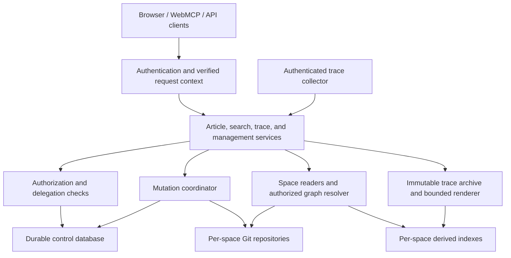

# Company wiki architecture

Status: implementation plan, September 12, 2026. Based on engine `901ff73` on
`main`, the [space design](spaces-and-access-control.md), and
[agent identity research](agent-identity-research.md). This document describes
planned changes, not current capabilities. Prepared with AI assistance.

## Scope and constraints

Build a wiki for personal, organizational, and cross-organization knowledge.
People and agents share spaces through explicit grants. Each space owns a content
Git repository; articles form one graph across the accessible spaces. Original
conversation traces are retained and searchable under their own space access.

There is no migration project or backward-compatibility requirement. Change APIs,
identifiers, configuration, and schemas directly; rebuild derived indexes. Do not
build dual readers, legacy endpoint adapters, schema upgrade machinery, or a
parallel old/new deployment. Existing articles, repositories, and original traces
must not be deleted or rewritten as a side effect of development or tests.

Keep the initial implementation a single Node service on one host with local Git
and SQLite. No OpenFGA deployment, distributed database, or separate process per
space is needed initially. The wiki is the resource and authorization service;
agent orchestration, model execution, and fleet-wide trace collection remain
integrations. This plan does not authorize deployment or changes to live storage.

## Current code and required changes

| Component                                         | Current behavior observed                                                                                              | Planned change                                                                                                                          |
| ------------------------------------------------- | ---------------------------------------------------------------------------------------------------------------------- | --------------------------------------------------------------------------------------------------------------------------------------- |
| `src/server.mjs`                                  | Constructs one `GitWiki`, article index, trace store, and render cache. Host/origin checks do not authenticate a user. | Authenticate first; build verified request context; dispatch to application services that authorize all access.                         |
| `src/git-wiki.mjs`                                | Identity is a basename; refresh validates all links against the same repository; history is first-parent.              | Keep per-repository committed snapshots and history; use explicit article IDs and separate graph resolution from repository validation. |
| `src/editor.mjs`                                  | Locks one repository, checks revisions, commits pages and an idempotency receipt, then optionally pushes.              | Preserve those correctness properties; place it behind an authenticated mutation coordinator and include trusted attribution.           |
| `src/wiki-search.mjs`                             | One SQLite index; article IDs are primary keys; backlinks and results are unfiltered.                                  | Index each space separately and query only authorized spaces; compose graph results through an authorized resolver.                     |
| `src/wiki.mjs`, `src/render.mjs`                  | Wiki links become `/wiki/ID/`; rendering embeds backlinks.                                                             | Resolve stable IDs and permission-sensitive metadata through application services; keep Markdown sanitization.                          |
| `src/traces.mjs`, `src/trace-worker.mjs`          | Immutable hash-addressed source snapshots; bounded rendering workers/cache.                                            | Retain original bytes, branching and source-line anchors; add space-qualified records and authorization before/after async reads.       |
| `src/trace-search.mjs`                            | Separate dialogue index, with user/assistant text and selected exclusions.                                             | Space-qualified search and an explicit all-record text search mode alongside dialogue search.                                           |
| `public/client.js`, `public/edit-contract.js`     | Browser fetches and WebMCP tools use the same HTTP API.                                                                | Share new schemas and authorized services; introduce space selection, current identity, and agent run context.                          |
| `scripts/import-trace.mjs`, `scripts/example.mjs` | Local operator import and one synthetic repository.                                                                    | Explicit destination space; synthetic multi-user, multi-space fixture; authenticated ingestion contract.                                |

The baseline has no standalone MCP server. If another transport is added, it must
call the same application services rather than implement a second permission layer.
Other branch implementations were not assumed to be part of this baseline.

## Component boundaries

Introduce small modules with explicit responsibilities:

- `control-store.mjs`: durable metadata, transactions, memberships, grants,
  delegations, sessions, operation journal, and audit events.
- `authn.mjs`: browser sessions and agent credential validation; identity mapping.
- `authorization.mjs`: pure permission decisions against authoritative state;
  no model calls and no caller-supplied authority assertions.
- `space-registry.mjs`: registered repository paths and readers, bounded refresh,
  health, and space lifecycle.
- `article-service.mjs`, `trace-service.mjs`, `search-service.mjs`: authorized
  operations used by every transport.
- `mutation-coordinator.mjs`: ordered control changes and content writes, locking,
  retry reconciliation, and publication tracking.

These are proposed module names, not a reason to introduce a framework. Storage
adapters remain internal; ordinary clients never call them with raw paths.

## Authoritative and derived storage

| Storage                                      | Authority                                                                                                                                                                                                                            |
| -------------------------------------------- | ------------------------------------------------------------------------------------------------------------------------------------------------------------------------------------------------------------------------------------ |
| `control.sqlite3`                            | Principals, external identity bindings, organizations, group membership, spaces/ownership/grants, agent definitions and ownership, delegations, sessions, trace associations, article location transitions, operation journal, audit |
| One Git repository per space                 | Committed article Markdown, local revision history, write receipts and move markers                                                                                                                                                  |
| Immutable trace archive                      | Original captured JSONL snapshots; attachment bytes when supported                                                                                                                                                                   |
| Per-space search databases and render caches | Disposable projections only                                                                                                                                                                                                          |

The control database is new authoritative state. It must never be deleted as an
index-rebuild step. Enable SQLite foreign keys, WAL, explicit transactions, and
appropriate durable synchronization. Keep it distinct from search databases in
configuration, file layout, backup commands, and operator documentation.

A space row maps to an administrator-provisioned path. A client supplies a space
ID, never a filesystem path or remote URL to clone. Repository provisioning uses
staged directories and a durable operation record; failed provisioning is not a
half-visible space. User-controlled paths, Git hooks, and arbitrary credential
commands are not part of the public API.

Back up the control database, all content repositories, and immutable trace/media
storage together while pausing mutations and ingestion at a consistent checkpoint.
Indexes can be rebuilt afterward. This is recovery support, not migration tooling.

## Data model

Use opaque, server-issued IDs. Map external identities by `(issuer, subject)` to a
local principal; email and display names are mutable attributes. An organization
owns/administers resources; it is not a login credential. Sharing with an entire
organization means granting to its Everybody group.

| Record                   | Important fields and invariants                                                                                                                                    |
| ------------------------ | ------------------------------------------------------------------------------------------------------------------------------------------------------------------ |
| Principal                | `id`, `kind=user                                                                                                                                                   | agent`, display name, active/suspended state; external identity bindings are verified, never self-asserted |
| Organization/member      | Organization ID, human member ID, administrative role, active status; organization admin rights apply only to owned resources                                      |
| Group/member             | Owner organization or user, members of type user/agent; no nested groups initially                                                                                 |
| Space                    | ID, owner user/organization, display name, repository registration, active/archived state                                                                          |
| Space grant              | Space, user/agent/group grantee, reader/editor/manager role; an optional expiry; grantor recorded                                                                  |
| Agent definition/version | Instructions and tool configuration, immutable version ID, controlling principal/organization                                                                      |
| Agent principal          | Principal ID, owner, selected definition, active state; separate invoke/configure/manage-access grants                                                             |
| Delegation               | Delegator, agent, explicit spaces/actions, expiry, revocation state; no subdelegation in the first release                                                         |
| Run                      | Agent, initiating principal or schedule, authority mode, delegation reference where applicable, allowed spaces/actions, trace space, definition version, lifecycle |
| Trace association        | Space ID, snapshot hash, capture provenance, run/session references; hash alone never grants access                                                                |
| Article location         | Article ID, active space, location generation, state; move journal preserves previous locations                                                                    |
| Operation/audit          | Actor, subject where applicable, authority mode/run, resource, request fingerprint, result, time, state/commit references                                          |

Reader permits content/history/trace reads. Editor includes reader and ordinary
content writes. Manager includes editor and space grant/lifecycle management. A
space editor cannot change its ownership or grants through frontmatter. Do not
permit removal of the last responsible owner/manager without assigning a replacement.

Everybody automatically contains active human members of its organization. Do not
automatically add guest users or agents. This is the initial implementation default;
explicit group membership and space grants handle both. A delegated agent can
exercise the user's Everybody access when the delegation includes that space.

External users and agents can receive grants without becoming members of the
resource owner's organization. A grant to an external group deliberately trusts
that group's membership administrators. Start with multiple organizations in one
installation. Federation between independently hosted installations is a separate
extension, not necessary to deliver cross-company sharing.

## Authentication and request context

Use a standards-based OIDC login adapter for humans, with a maintained library,
server-side sessions, secure HttpOnly cookies, CSRF protection, and logout/revocation.
The foundation uses direct Google OIDC through `openid-client`, with optional
generic OIDC and independent local email/password accounts. Do not implement OAuth
cryptography by hand. Keep the identity-provider contract separate from the space
model. Production starts without anonymous content access.

Bootstrap the first administrator through an explicit local operator command bound
to an expected external identity or an explicit local-account setup link. Never
promote the first public visitor. Synthetic
examples use a development identity provider bound to loopback with synthetic data;
that mode cannot be enabled against arbitrary content through a request header.

Agents authenticate as their own registered principal. Initially use an operator-
provisioned public key or trusted workload identity to acquire short-lived wiki
credentials through a trusted runtime/broker. Authentication libraries and token
profile are implementation selections, not a bespoke protocol requirement. Keep
signing keys and refresh credentials outside model-readable files and trace output.

The verified context contains actor, optional delegating subject, authority mode,
run/delegation references, credential expiry, and permitted resource/action scope.
Client-supplied run IDs must be checked against the actor's recorded run. Validate
issuer, audience, expiry, signature, and current suspension/revocation state. Tokens
identify authority but do not freeze membership/grants indefinitely.

The service receives an explicit mode for each run. Delegated access requires:
current user access AND valid delegation AND run scope AND applicable policy.
Own-authority access requires current agent grants AND run scope AND policy.
Invoke permission is checked separately. Never union modes or fall back to a
stronger credential after denial. The first implementation fixes mode for a run;
mixed workflows create explicitly scoped child runs, not hidden credential switching.

Configuring an agent is a privileged resource operation because it can redirect
existing authority. Changes to tools, instructions, or destinations create a new
definition version and are audited. Existing runs remain bound to their version;
suspension can stop them. Ordinary article editing does not grant agent configuration
rights or trigger approval prompts.

## Articles, history, and graph identity

Assign immutable article UUIDs in frontmatter and make filenames/slugs presentation
choices. Canonical current URLs use `/articles/{articleId}`. References use
`[[articleId|label]]`; an omitted label is resolved only when the target is readable.
Search and an editor link picker expose titles so users need not type UUIDs.

Markdown contains the article ID, not authoritative space grants or ownership.
The repository registration establishes its space. Reject duplicate live IDs,
including duplicates across repositories, except an explicitly journaled move.
Retain blob-based optimistic revision checks, paired with location generation to
prevent a stale edit landing in a different space after a move.

Historical identity is `(spaceId, articleId, commit)` and remains bound to the
repository where that version was written. History requests first authorize the
historical space, not just the article's current location. A move does not publish
old history into the destination. Revision numbers, if displayed, are local to the
space; clients use opaque revision references rather than assuming global numbering.

Separate Markdown integrity from link reachability. A missing or inaccessible
cross-space target must not invalidate a whole repository. Validate link syntax;
the link picker can verify accessible targets. Render unresolved/inaccessible
targets identically without fetching their titles or disclosing whether they exist.
An explicitly authored label is content of the source article and remains visible.

Graph edges are derived from articles. Backlinks require read access to their source;
previews require read access to their target. Filter catalogues, graph nodes, counts,
facets, error messages, health details, and resource existence checks too. Global
article location data is internal and never an unauthenticated directory.

## Search, rendering, and caching

Use one derived article/trace search store per space, initially backed by existing
SQLite FTS5 components. Query the currently authorized spaces only, applying optional
user scope filters as a further restriction. Never retrieve forbidden text into a
model and ask it to ignore it.

Return article and trace groups separately within one search interface. Merge
per-space ranked results deterministically by reciprocal rank with stable ID tie
breaks; do not compare raw BM25 scores from different corpora. Use bounded result
windows and expose truncation. Pagination tokens bind query, selected spaces, and
an authorization generation; restart pagination when that generation changes.
Inaccessible spaces must not affect returned counts, snippets, or ranking statistics.

Cache source parsing by immutable blob/hash. Do not share rendered navigation,
backlinks, resolved titles, or whole responses across audiences. Initially use
request-local permission-sensitive rendering and `no-store` responses. Authorize
before reading cached content and recheck after async work before returning it.
Internal caches and pending jobs never substitute for authorization.

Refresh registered spaces independently with a bounded queue. An invalid content
snapshot may retain that space's last valid reader data while reporting degradation
only to authorized viewers. An unavailable control database fails closed; stale
permissions are never the fallback. Avoid one Git refresh of every repository on
every request.

## Writes and consistency

Keep revision-checked batches of up to ten articles atomic within one space.
Reject ordinary batches spanning spaces. Lock the space repository, validate
expected revisions and location generations, and commit content plus a trusted
receipt through the existing private-index/compare-and-swap mechanism.

Serialize policy mutations and final content publication through a single service
mutation coordinator. Check authoritative rights inside that ordering boundary,
not only before enqueueing. A revocation ordered before a write prevents the write;
one ordered afterward does not retroactively undo a committed edit. Do not hold
an SQLite transaction open while waiting on a Git subprocess.

Write an operation-intent record before Git mutation. Include actor, subject/run,
space, fingerprint, and operation ID in the trusted writer envelope and committed
receipt; clients cannot supply authoritative attribution. Complete the control
journal and audit after the Git commit. On a crash, reconcile unfinished operations
against committed receipts before accepting further conflicting writes. SQL and
Git do not form one atomic transaction; the journal makes that gap recoverable.

Idempotency is keyed by space, authenticated actor, and operation ID. Retry still
requires current authorization and matching payload/authority context. Preserve
separate local-save, reader-publication, and remote-push results; a failed push
never justifies repeating a committed edit. Public receipt reads authorize both
the space and the receipt audience before returning metadata.

Remove ordinary-user access to the raw writer CLI. An operator maintenance command
remains trusted administrative access with explicit attribution. In the first
version, coordinate direct Git maintenance by pausing the service writer; agents
and users edit through the API. Repository access is not a second end-user RBAC system.

### Cross-space moves

Implement moves as a dedicated operation after ordinary writes work. Require manage
permission on the source and edit permission on the destination. Moving broadens
or changes publication and is not an ordinary edit.

Journal phases: prepared, destination committed but unpublished, source removal
committed, location activated, complete. The destination contains current Markdown
only. Retain original history in the source and commit move markers/receipts in
both repositories. The registry exposes only the active location; the temporary
copy must not enter destination search, history, or direct reads before activation.
Reserve the article ID and lock spaces in a deterministic order.

Recovery resumes or resolves the recorded operation idempotently. Permissions are
rechecked before activation. If authorization is lost before activation, keep the
operation hidden and blocked for an authorized operator to resolve; do not publish
it automatically or discard the already committed source bytes. Test failures at
every phase. No claim of a cross-repository atomic Git transaction is made.

## Trace capture, visibility, and search coverage

Require an explicit trace space on every run/import. Default delegated personal
runs to the user's private space and independent workers to a dedicated restricted
working space selected by their manager. Shared sessions select their destination
before capture; do not infer sharing from the agent's full read permissions.

A raw trace is an independently retained record under its destination space policy.
It may contain tool results and other material absent from an authored article.
Revoking access to a source space does not automatically erase or reclassify earlier
traces. Managers must understand that changing trace-space grants shares full records.
If a company requires additional retention/disclosure controls, make that an explicit
policy rather than silently applying article source-permission inheritance.

Capture all supported records, branches, tool calls/results, unknown fields, and
original source bytes. Import growing sessions as immutable snapshots with a stable
session reference and exact hash/line citations. A snapshot association is space-
qualified even when identical bytes occur elsewhere. Do not let a hash reveal other
spaces where those bytes exist.

Keep dialogue search as the default and add an explicit all-record text mode for
tool results, recorded reasoning, and other textual fields. Chunk large fields with
source-line/field references. Binary and encrypted payloads remain retrievable
originals; searchable metadata does not imply OCR, transcription, or decryption.
Capture status must distinguish imported, indexed, pending, and failed; durable
retry/checkpoint state belongs to ingestion, never to a lossy parser projection.

The wiki exposes authenticated append/import operations and a rebuild command.
Collectors own discovery of sessions on machines and delivery retries. Absence of
an imported trace is not evidence that nothing occurred. Raw evidence remains
untrusted historical content, not agent instructions. Store verified actor/run
provenance separately and audit reassignment without rewriting originals.

## Interfaces and user experience

Use resource IDs, space IDs, and explicit context in new endpoints. Proposed groups:

- `/api/me`, `/api/spaces`, `/api/spaces/{id}/grants` for identity and sharing.
- `/api/search` for authorized article/trace search and selected-space filtering.
- `/api/articles/{id}` and space-qualified revision reads for content/history.
- `/api/spaces/{id}/edits` and `/api/article-moves` for writes.
- `/api/spaces/{id}/traces` for authorized imports/catalogues and hash/line reads.
- `/api/agents`, agent control grants, delegations, and runs for agent integration.

Finalize exact schemas with each milestone. An unauthenticated request receives 401. Hidden resources and unknown IDs both return 404; known-but-disallowed actions
can return 403 without revealing hidden metadata. Keep structured revision and
idempotency conflicts. Replace the global `X-Wiki-Commit` header with resource-
scoped revision metadata; no response should disclose an unrelated repository HEAD.

The UI offers My space, shared/group spaces, and search across accessible spaces.
Show owner organization on external spaces and groups. Space sharing lists people,
groups, agents, and Everybody with roles. Agent settings show its own access,
who may use/configure it, and whether a task is delegated or independent. Article
creation and trace sessions show their destination audience. Git remains invisible
to ordinary users. Standard same-space editing remains automatic.

## Decisions deliberately deferred

Provider/library selection and concrete token formats are milestone-one engineering
choices. Cross-installation federation, nested groups, per-document/folder ACLs,
subdelegation, automatic multimodal trace extraction, and distributed deployment
are later extensions. They are not prerequisites for the initial model.

Follow the [implementation milestones](implementation-plan.md) for sequencing and
acceptance criteria. All examples and tests must use synthetic content and temporary
repositories, with no reads or mutations of live content for test fixtures.
